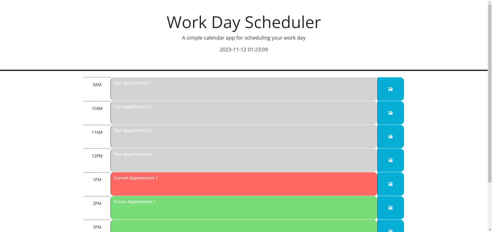

# Workday Scheduler

## workday-scheduler

## Description

This is a simple calendar application that leverages DayJS to compare times and display scheduled events per hour and render either past, present, or future styling to each block. This allows for a visual indication of whether the scheduled event is in the past, current, or in the future. All events are saved into local storage and displayed in a basic HTML page.

Link to GitHub Page: https://dan-watkins.github.io/workday-scheduler/

## Table of Contents

- [Installation](#installation)
- [Usage](#usage)
- [Contribution](#contribution)
- [Tests](#tests)
- [License](#license)
- [Questions](#questions)

## Installation

Only requirement is DayJS, which is linked in the HTML file as a script already.

## Usage

Enter the desired text for an event in the desired timeslot and hit "Save" icon. This sets the information in local storage. Calendar should already load whether the timeslots are past, present, or future based on DayJS code. Grey is past, Red is current, Green is future.

## Contribution

N/A

## Tests

N/A

## License

N/A

## Questions

You can reach me at danielwatkins@byu.net or find me at https://github.com/dan-watkins
